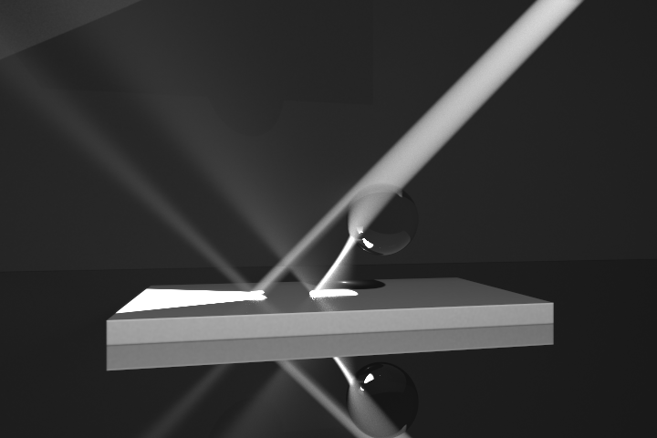

# MeowLens

> 超慢速光线追踪

算法来自 Knaus, Claude, and Matthias Zwicker. "Progressive photon mapping: A probabilistic approach." ACM Transactions on Graphics (TOG) 30.3 (2011): 1-13. 支持体积光。

引用及 Report 见 [report/final.pdf](report/final.pdf)

## License
本项目内所有源代码及文档均在 MIT 协议下予以公开。请您确保在使用中与协议不产生冲突。具体协议内容可以参考 LICENSE 文件。
